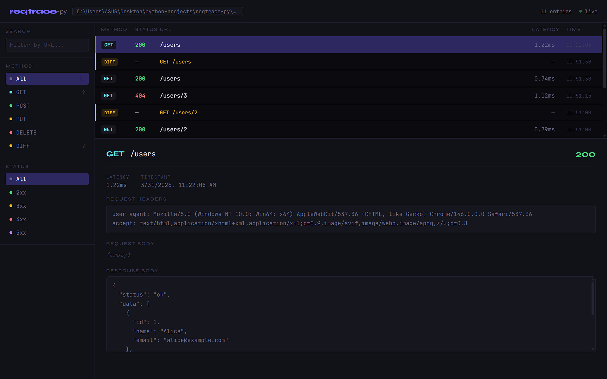

<p align="center">
  
</p>

# reqtrace-py

Lightweight HTTP request/response logger for Python web frameworks. Designed for developers who need clear, structured debug output without writing `print()` everywhere.

## Features

- Auto-log every request & response via middleware
- Colorized terminal output with status color coding
- File output in JSON (NDJSON) or plain text format
- Configurable output mode: terminal, file, or both
- Auto-diff mode — detects response changes per endpoint automatically
- Filter log by route, method, or status code (whitelist & blacklist)
- Press `c` to clear terminal while server is running
- Authorization header auto-masking
- Web UI log viewer via CLI (`reqtrace view`)

## Installation

```bash
pip install reqtrace-py
```

> The package is installed as `reqtrace-py` but imported as `reqtrace`.

## Quickstart

```python
from fastapi import FastAPI
from reqtrace import ReqTrace
from reqtrace.middleware import ReqTraceMiddleware

rt = ReqTrace(output="terminal")

app = FastAPI()
app.add_middleware(ReqTraceMiddleware, config=rt.config)
```

That's it — every request will be logged automatically.

## Output Modes

```python
# Terminal only (default)
rt = ReqTrace(output="terminal")

# File only — JSON format
rt = ReqTrace(output="file", file_path="logs/trace.json")

# File only — plain text
rt = ReqTrace(output="file", file_path="logs/trace.txt", file_format="txt")

# Both terminal and file
rt = ReqTrace(output="both", file_path="logs/trace.json")

# Disabled (useful for production)
rt = ReqTrace(output="terminal", enabled=False)
```

## Web UI Viewer

Visualize your log file in a browser-based UI with real-time updates, filtering, search, and diff viewer.

<p align="center">
  
</p>

First, configure reqtrace to write to a file:

```python
rt = ReqTrace(output="file", file_path="logs/trace.json")
# or both terminal and file
rt = ReqTrace(output="both", file_path="logs/trace.json", diff=True)
```

Then open the viewer from your terminal:

```bash
reqtrace view logs/trace.json
```

The UI will open automatically at `http://localhost:8765`.

```bash
# Custom port
reqtrace view logs/trace.json --port 8080

# Don't open browser automatically
reqtrace view logs/trace.json --no-browser
```

**UI features:**

- Table view of all log entries, sorted newest first
- Click any row to inspect full request/response detail
- Resizable detail panel — drag the handle between table and detail
- Filter by method (GET, POST, PUT, DELETE, DIFF) and status code (2xx–5xx)
- Search by URL
- Diff viewer — shows added, removed, and changed fields
- Live updates via SSE — new entries appear automatically without refresh

## Filter

Control which requests are logged using whitelist or blacklist mode.

```python
from reqtrace import ReqTrace, ReqTraceFilter

# Whitelist — only log errors
rt = ReqTrace(
    output="terminal",
    filters=ReqTraceFilter(
        mode="whitelist",
        status_codes=["4xx", "5xx"],
    )
)

# Whitelist — only log specific methods
rt = ReqTrace(
    output="terminal",
    filters=ReqTraceFilter(
        mode="whitelist",
        methods=["POST", "PUT", "DELETE"],
    )
)

# Blacklist — hide docs routes and all 200 responses
rt = ReqTrace(
    output="terminal",
    filters=ReqTraceFilter(
        mode="blacklist",
        routes=["/docs", "/redoc", "/openapi.json"],
        status_codes=[200],
    )
)
```

Filter rules:

- **whitelist** — only log requests that match the filter. Empty whitelist logs nothing.
- **blacklist** — log everything except requests that match the filter. Empty blacklist logs everything.
- Filters can be combined: `routes`, `methods`, and `status_codes` are evaluated with OR logic.
- `status_codes` accepts specific codes (`404`) or ranges (`"4xx"`, `"5xx"`), or mixed (`[404, "5xx"]`).

## Auto-Diff

Enable auto-diff to automatically compare each response against the previous one for the same endpoint. Useful for detecting unintended changes after modifying your code.

```python
rt = ReqTrace(output="terminal", diff=True)

# With file output
rt = ReqTrace(output="both", file_path="logs/trace.json", diff=True)
```

On the first request to an endpoint, reqtrace saves a snapshot. On every subsequent request to the same endpoint, it compares and displays what changed:

```
┌─ DIFF GET /users ────────────────────────────────────────────
  +1  -0  ~0
  + data[2]     {'id': 3, 'name': 'Diz', 'email': 'diz@example.com'}
└──────────────────────────────────────────────────────────────
```

Diff symbols:

- `+` — field or item added
- `-` — field or item removed
- `~` — value or type changed

## Terminal Output Example

```
┌─ REQUEST ────────────────────────────────────────────────────
  POST    /api/users
  content-type: application/json
  Body:
    {
      "name": "Diz",
      "email": "diz@mail.com"
    }
├─ RESPONSE ───────────────────────────────────────────────────
  Status :  422  43.2ms
  Body:
    {
      "detail": [{"loc": ["body", "email"], "msg": "value is not a valid email"}]
    }
└──────────────────────────────────────────────────────────────
```

Status codes are color-coded:

- 🟢 `2xx` — green
- 🟡 `3xx` — yellow
- 🔴 `4xx` — red
- 🟣 `5xx` — magenta

## Clear Terminal

While the server is running, press `c` to clear the terminal output. The key can be customized or disabled:

```python
# Custom key
rt = ReqTrace(output="terminal", clear_key="r")

# Disable
rt = ReqTrace(output="terminal", clear_key=None)
```

## JSON Log Format

Each log entry is one JSON object per line (NDJSON), easy to stream and parse:

```json
{"timestamp": "2026-03-23T10:15:00+00:00", "method": "POST", "url": "/api/users", "status_code": 422, "latency_ms": 43.2, "request_headers": {...}, "request_body": {"name": "Diz"}, "response_body": {...}}
```

Diff entries are written as a separate record with `"type": "diff"`:

```json
{"timestamp": "2026-03-23T10:16:00+00:00", "type": "diff", "method": "GET", "url": "/users", "changes": {"added": [{"path": "data[2]", "value": {...}}], "removed": [], "changed": []}, "has_changes": true}
```

## Configuration Reference

| Parameter     | Type                                 | Default      | Description                                               |
| ------------- | ------------------------------------ | ------------ | --------------------------------------------------------- |
| `output`      | `"terminal"` \| `"file"` \| `"both"` | `"terminal"` | Where to send log output                                  |
| `file_path`   | `str`                                | `None`       | Log file path. Required if output is `"file"` or `"both"` |
| `file_format` | `"json"` \| `"txt"`                  | `"json"`     | Log file format                                           |
| `enabled`     | `bool`                               | `True`       | Master on/off switch                                      |
| `diff`        | `bool`                               | `False`      | Enable auto-diff per endpoint                             |
| `clear_key`   | `str \| None`                        | `"c"`        | Terminal clear shortcut. `None` to disable                |
| `filters`     | `ReqTraceFilter \| None`             | `None`       | Filter which requests are logged                          |

### ReqTraceFilter Reference

| Parameter      | Type                           | Default       | Description                                       |
| -------------- | ------------------------------ | ------------- | ------------------------------------------------- |
| `mode`         | `"whitelist"` \| `"blacklist"` | `"blacklist"` | Filter mode                                       |
| `routes`       | `list[str]`                    | `[]`          | Routes to filter. Supports exact and prefix match |
| `methods`      | `list[str]`                    | `[]`          | HTTP methods to filter. Case-insensitive          |
| `status_codes` | `list[int \| str]`             | `[]`          | Status codes to filter. Accepts `404` or `"4xx"`  |

## Requirements

- Python >= 3.10
- Starlette >= 0.27.0

## Changelog

### v0.4.0

- Web UI log viewer via `reqtrace view <file>` CLI command
- Table layout with resizable detail panel
- Real-time updates via SSE — new entries appear without refresh
- Filter by method, status code, and URL search in the UI
- Diff viewer in detail panel
- Log entries sorted newest first

### v0.3.0

- Filter log by route, method, and status code
- Whitelist and blacklist mode
- `status_codes` supports specific codes and ranges (`"4xx"`, `"5xx"`)

### v0.2.0

- Auto-diff mode (`diff=True`) — compares responses per endpoint automatically
- Diff output in both terminal and file
- Press `c` to clear terminal (configurable via `clear_key`)
- Fix: `CTRL+C` now works correctly when `clear_key` is active

### v0.1.0

- Initial release
- Request/response logging via middleware
- Terminal (colorized) and file (JSON/txt) output

## Roadmap

- `v0.5.0` — Flask/Django support

## License

MIT
